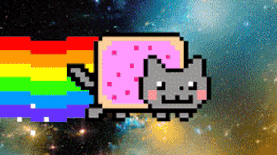

<h1 align="center">
    
</h1>

<h1>
    
</h1>

<h3 align="center">
    <a href="https://ejec.ufsc.br/"> Acessar site da EJEC
</h3>

# Indice

- [Sobre](#-sobre)
- [Tecnologias Utilizadas](#-tecnologias-utilizadas)
- [Como baixar o projeto](#-como-baixar-o-projeto)


## Sobre

Criação do meu primeiro **README**, o gif do nyan cat travou :(

---

## Tecnologias utilizadas

Projeto criado com

- [HTML](https://www.w3schools.com/html/)
- [CSS](https://www.w3schools.com/css/)

---

## Como baixar o projeto

```bash
# clonar repositorio
 $ git clone https://github.com/LuskaGarcia/Roadmap/tree/main/Site%20Responsivo

# entrar no diretorio
 $ cd siteResponsivo

#instalar as dependencias
 $ yarn install

#iniciar o projeto
 $ yan start
```

---

Foi desenvolvido por Lucas Garcia